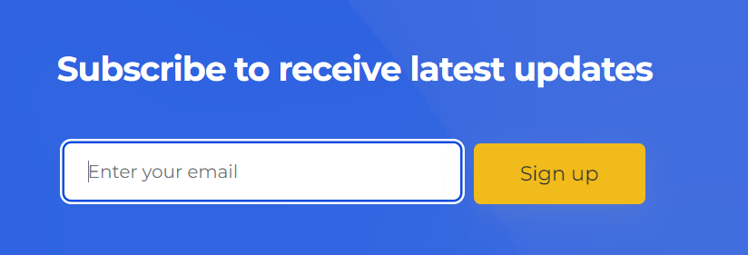

# Subscribe to Mailing List

## Goal:
Setup a program that asks the user for their email and stores it for use in a mailing list.

## Possible Solutions:
1. Use a text file to store emails (requires node.js)
2. Use a database